# LegalShield Chat Core Flow Documentation

## Tổng quan
LegalShield Chat là hệ thống tư vấn pháp lý AI sử dụng RAG (Retrieval-Augmented Generation) để cung cấp câu trả lời pháp lý chính xác với trích dẫn từ nguồn pháp lý.

---

## Workflow Diagram (Dành cho người không kỹ thuật)

### Backend Flow - Hệ thống xử lý câu hỏi (Chi tiết)

```mermaid
flowchart TD
    subgraph Phase0["Phase 0: Xác thực & Chuẩn hóa<br/>~50ms - SYNC (Chờ)"]
        A[Người dùng gửi câu hỏi] --> B[Xác thực người dùng<br/>JWT Token]
        B --> C[Kiểm tra giới hạn tốc độ<br/>8 request/phút]
        C --> D[Chuẩn hóa dữ liệu<br/>Consolidate attachments]
        D --> E{Có document_context không?}
        E -->|Không có| F[document_hash = null]
        E -->|Có| G[Generate document_hash<br/>Từ document_context]
    end

    F --> H{Có hình ảnh không?}
    G --> H

    subgraph Phase1["Phase 1: Phân tích hình ảnh<br/>~1-2s - PARALLEL (Song song với Phase 2)"]
        H -->|Có| I[Fetch hình ảnh từ Storage<br/>Song song nhiều ảnh]
        H -->|Không| J[Bỏ qua Phase 1]
        I --> K[AI phân tích hình ảnh<br/>OCR trích xuất văn bản]
        K --> L[Tóm tắt nội dung hình ảnh]
        J --> L
    end

    L --> M{Câu hỏi đơn giản không?<br/>Dưới 100 ký tự, không tài liệu}

    subgraph Phase2["Phase 2: Phân tích câu hỏi<br/>~300ms - PARALLEL (Song song với Phase 1)"]
        M -->|Có| N[Phân tích nhanh<br/>Heuristic - không cần AI<br/>~0ms]
        M -->|Không| O[AI phân tích ý định<br/>Song song 2 LLM calls]
        N --> P[Chuẩn hóa câu hỏi<br/>normalizeLegalQuery]
        O --> P
    end

    P --> Q[Kiểm tra Cache<br/>Đã trả lời câu này chưa?]

    subgraph Phase3["Phase 3: Cache Check<br/>~100ms - PARALLEL (Song song)"]
        Q --> R[Check Exact Cache<br/>Redis - cùng câu hỏi + context]
        Q --> S[Generate Embedding<br/>Voyage AI - 768 dimensions]
        R --> T{Cache hit không?}
        S --> T
        T -->|Có câu trả lời cũ| U[Trả lời ngay<br/>Fastest Path ~100ms]
        T -->|Chưa có| V[Check Semantic Cache<br/>Vector similarity search]
        V --> W{Semantic cache hit?}
        W -->|Có| U
        W -->|Không| X[Tìm kiếm pháp lý<br/>Song song 3 nguồn]
    end

    subgraph Phase4["Phase 4: Retrieval<br/>~500-800ms - PARALLEL (Song song 3 nguồn)"]
        X --> Y[Tìm trong lịch sử chat<br/>pgvector - top 5 messages]
        X --> Z[Tìm trên internet<br/>Exa API - external legal sources]
        X --> AA[Tìm trong tài liệu upload<br/>document_chunks - vector search]
        Y --> AB[Đánh giá lại kết quả<br/>Jina Reranking API]
        Z --> AB
        AA --> AB
    end

    subgraph Phase5["Phase 5: Reranking & Filter<br/>~200-300ms - SYNC (Chờ)"]
        AB --> AC[Combine tất cả sources<br/>Memory + Exa + Local]
        AC --> AD[Jina Rerank API<br/>Sắp xếp theo độ liên quan]
        AD --> AE{Score >= 0.25?}
        AE -->|Có| AF[Chọn evidence đạt threshold]
        AE -->|Không| AG[Fallback: Top 3 candidates]
        AF --> AH{Có đủ evidence không?}
        AG --> AH
        AH -->|Không đủ| AI[Abstain: Thông báo không có căn cứ]
        AH -->|Đủ| AJ[Xây dựng câu trả lời<br/>Ghép sources + system prompt]
    end

    subgraph Phase6["Phase 6: Streaming<br/>~1-3s - ASYNC (Streaming)"]
        AJ --> AK[Send evidence trước<br/>Nếu có citations]
        AK --> AL[Stream response từ Gemini<br/>Từng đoạn cho người dùng]
        AL --> AM[Send done payload<br/>Metadata + citations]
        AM --> AN[Background: Save Cache<br/>Exact + Semantic]
        AN --> AO[Background: Save Memory<br/>Chat pgvector]
        AO --> AP[Background: Audit Logging]
        AP --> AQ[Background: RAG Optimization<br/>Deduplication + Filtering]
        AQ --> AR[Await: Auto-titling<br/>~500ms - BLOCKING]
    end

    U --> AS[Hoàn thành]
    AI --> AS
    AR --> AS
```



### Frontend Flow - Giao diện người dùng (Chi tiết)

```mermaid
flowchart TD
    subgraph Phase1["Phase 1: Optimistic UI<br/>~10ms - SYNC (Hiện ngay)"]
        A[Người dùng nhập câu hỏi] --> B[Hiển thị ngay trên màn hình<br/>Optimistic UI với local ID]
        B --> C[Clear attachments<br/>Xóa hình ảnh/tài liệu khỏi UI]
    end

    C --> D{Có upload file không?}

    subgraph Phase2["Phase 2: Document Upload<br/>~500ms - PARALLEL (Song song)"]
        D -->|Có| E[Upload file lên Cloudinary<br/>Song song với đọc file]
        D -->|Không| F[Bỏ qua Phase 2]
        E --> G[Đọc nội dung file<br/>Text files: FileReader]
        G --> H[Consolidate uploaded docs<br/>storage_path + document_context]
        F --> H
    end

    H --> I[Gửi câu hỏi đến hệ thống<br/>POST /functions/v1/legal-chat]

    subgraph Phase3["Phase 3: Backend Processing<br/>~2-6s - ASYNC (Chờ server)"]
        I --> J[Hệ thống xử lý<br/>Backend 8 phases]
        J --> K[Nhận câu trả lời từng đoạn<br/>SSE Streaming]
    end

    subgraph Phase4["Phase 4: Streaming Response<br/>~2-6s - ASYNC (Streaming)"]
        K --> L[Parse SSE chunks<br/>chunk | evidence | done]
        L --> M{Chunk type?}
        M -->|chunk| N[Append nội dung<br/>Update UI in real-time]
        M -->|evidence| O[Set streaming evidence<br/>Hiển thị citations]
        M -->|done| P[Save message to database<br/>Background]
        N --> Q{Streaming done?}
        O --> Q
        P --> Q
        Q -->|Chưa| L
        Q -->|Rồi| R[Update savedMessageId<br/>Replace local ID với DB ID]
    end

    subgraph Phase5["Phase 5: Background Operations<br/>Non-blocking (Không chờ)"]
        R --> S[Debounce: Chờ 5 giây<br/>Trước khi gợi ý]
        S --> T[Generate suggestions<br/>LLM call]
        T --> U[Cache suggestions<br/>Redis]
        U --> V[Hiển thị gợi ý<br/>Dựa trên context cuộc chat]
    end

    V --> W[Hoàn thành]
```

### Retry Logic - Xử lý lỗi API (Chi tiết)

```mermaid
flowchart TD
    subgraph Phase0["Phase 0: Initiate API Call<br/>SYNC"]
        A[Gọi API bên ngoài<br/>Groq, Gemini, Exa...] --> B{Thành công không?}
    end

    B -->|Thành công| C[Trả về kết quả<br/>~50-500ms]

    subgraph Phase1["Phase 1: 429 Error Handling<br/>NO LIMIT - Retry ALL keys"]
        B -->|Lỗi 429 - Hết quota| D[Round-robin: Chuyển sang API key khác<br/>forceNext = true]
        D --> E{Còn key nào không?}
        E -->|Còn| F[Thử lại với key mới<br/>NO DELAY - switch ngay lập tức]
        F --> B
        E -->|Hết| G[Thông báo lỗi chung chung<br/>"Hệ thống không thể trả lời ngay lúc này"]
    end

    subgraph Phase2["Phase 2: 500 Error Handling<br/>MAX 5 retries"]
        B -->|Lỗi 500 - Server lỗi| H[Round-robin: Chuyển sang API key khác]
        H --> I{Đã thử 5 lần chưa?}
        I -->|Chưa| J[Thử lại với key mới<br/>Exponential backoff]
        J --> B
        I -->|Rồi| G
    end

    B -->|Lỗi 401/403 - Auth| K[Round-robin: Chuyển sang API key khác]
    K --> L{Còn key nào không?}
    L -->|Còn| M[Thử lại với key mới<br/>NO DELAY]
    M --> B
    L -->|Hết| G

    B -->|Lỗi khác| G

    C --> N[Hoàn thành]
    G --> N
```

---

## Giải thích nghiệp vụ đơn giản

### Backend - Hệ thống xử lý (Server) - 6 Phases

**Phase 0: Xác thực & Chuẩn hóa (~50ms - Chờ)**
- Xác thực người dùng bằng JWT token
- Kiểm tra giới hạn tốc độ (8 request/phút)
- Chuẩn hóa dữ liệu input
- Generate document_hash từ document_context (nếu chưa có)

**Phase 1: Phân tích hình ảnh (~1-2s - Song song với Phase 2)**
- Fetch hình ảnh từ Storage (song song nhiều ảnh)
- AI phân tích hình ảnh (OCR trích xuất văn bản)
- Tóm tắt nội dung hình ảnh

**Phase 2: Phân tích câu hỏi (~300ms - Song song với Phase 1)**
- Nếu câu hỏi đơn giản: Dùng heuristic (không cần AI)
- Nếu câu hỏi phức tạp: AI phân tích ý định song song 2 LLM calls
- Chuẩn hóa câu hỏi (normalizeLegalQuery)

**Phase 3: Cache Check (~100ms - Song song)**
- Check Exact Cache (Redis) - cùng câu hỏi + context
- Generate Embedding (Voyage AI - 768 dimensions)
- Check Semantic Cache (Vector similarity search)
- Nếu cache hit → Trả lời ngay (Fastest Path ~100ms)

**Phase 4: Retrieval (~500-800ms - Song song 3 nguồn)**
- Tìm trong lịch sử chat (pgvector - top 5 messages)
- Tìm trên internet (Exa API - external legal sources)
- Tìm trong tài liệu upload (document_chunks - vector search)

**Phase 5: Reranking & Filter (~200-300ms - Chờ)**
- Combine tất cả sources (Memory + Exa + Local)
- Jina Rerank API - Sắp xếp theo độ liên quan
- Filter bằng threshold 0.25
- Fallback: Top 3 candidates nếu không có
- Abstain nếu không đủ evidence

**Phase 6: Streaming (~1-3s - Async Streaming)**
- Send evidence trước (nếu có citations)
- Stream response từ Gemini (từng đoạn)
- Background: Save Cache (Exact + Semantic)
- Background: Save Memory (Chat pgvector)
- Background: Audit Logging
- Background: RAG Optimization (Deduplication + Filtering)
- Await: Auto-titling (~500ms - BLOCKING)

### Frontend - Giao diện (App) - 5 Phases

**Phase 1: Optimistic UI (~10ms - Hiện ngay)**
- Hiển thị câu hỏi ngay trên màn hình với local ID
- Clear attachments khỏi UI

**Phase 2: Document Upload (~500ms - Song song)**
- Upload file lên Cloudinary (song song với đọc file)
- Đọc nội dung file (Text files: FileReader)
- Consolidate uploaded docs (storage_path + document_context)

**Phase 3: Backend Processing (~2-6s - Chờ server)**
- Gửi câu hỏi đến hệ thống
- Hệ thống xử lý (Backend 8 phases)
- Nhận câu trả lời từng đoạn (SSE Streaming)

**Phase 4: Streaming Response (~2-6s - Streaming)**
- Parse SSE chunks (chunk | evidence | done)
- Append nội dung - Update UI in real-time
- Set streaming evidence - Hiển thị citations
- Save message to database (Background)
- Update savedMessageId - Replace local ID với DB ID

**Phase 5: Background Operations (Không chờ)**
- Debounce: Chờ 5 giây trước khi gợi ý
- Generate suggestions (LLM call)
- Cache suggestions (Redis)
- Hiển thị gợi ý dựa trên context cuộc chat

### Retry Logic - Xử lý lỗi

**Lỗi 429 (Hết quota)**
- Retry hết toàn bộ API keys (NO LIMIT)
- Không có delay - switch key ngay lập tức
- Nếu hết keys → Thông báo lỗi chung chung

**Lỗi 500 (Server lỗi)**
- Retry tối đa 5 lần
- Exponential backoff
- Nếu hết 5 lần → Thông báo lỗi chung chung

**Lỗi 401/403 (Auth Error)**
- Retry với API key khác
- Không có delay
- Nếu hết keys → Thông báo lỗi chung chung

**Lỗi khác**
- Thông báo lỗi chung chung cho người dùng
- Không báo chi tiết kỹ thuật

---

## Core Flow Chat (Backend: `legal-chat/index.ts`)

### Phase 0: Authentication & Validation (SYNC)
**Thời gian**: ~50ms
**Loại**: Đồng bộ (Blocking)

1. **JWT Authentication**: Xác thực user token từ Supabase Auth
2. **Rate Limiting**: Giới hạn 8 request/phút/user
3. **Input Normalization**:
   - Consolidate attachments (images, documents)
   - Generate `document_hash` từ `document_context` nếu chưa có (FIX mới)
   - Xử lý `compactDocumentContext` từ các nguồn

### Phase 1: Vision Processing (PARALLEL)
**Thời gian**: ~1-2s
**Loại**: Song song với Intent Evaluation (nếu có ảnh)

```typescript
// Chạy song song khi có image attachments
if (allAttachments.length > 0) {
  images = await Promise.all(allAttachments.map(fetchImage))
  visionSummary = await callVisionLLM(images, prompt)
}
```

**Output**: `visionSummary` - Tóm tắt nội dung hình ảnh/OCR

### Phase 2: Intent Evaluation (PARALLEL)
**Thời gian**: 
- **Fast path (heuristic)**: ~0ms (bỏ qua LLM)
- **Normal path (LLM)**: ~300ms
**Loại**: Song song với Standalone Query Generation

#### 2a. Fast Path (Heuristic)
```typescript
if (isSimpleQuestion && !document_context && !visionSummary) {
  // Bỏ qua LLM, dùng heuristic
  intent_eval = { intent: 'general', complexity: 'low', ... }
}
```

#### 2b. Normal Path (Parallel LLM Calls)
```typescript
const [evalResult, queryResult] = await Promise.all([
  evaluateIntent(message, history, context_summary),  // Groq LLM
  buildStandaloneQuery(history, enrichedMessage)      // Groq LLM
])
```

**Output**: 
- `intent_eval`: { intent, needs_citations, complexity, is_drafting, suggested_standalone_query }
- `standaloneQuery`: Câu hỏi độc lập cho RAG

### Phase 3: Cache Check (PARALLEL)
**Thời gian**: ~100ms
**Loại**: Song song Exact Cache + Embedding

```typescript
const [exactCacheResult, queryEmbeddingForCache] = await Promise.all([
  getCachedLegalAnswer(answerCacheKey),  // Redis exact cache
  embedText(standaloneQuery, 768)       // Voyage AI embedding
])
```

**Cache Key Components** (FIX mới):
- `normalizedMessage` (chuẩn hóa câu hỏi)
- `effectiveDocumentHash` (hash của document hoặc tự generate từ context)
- `contextSummary` (last 2 messages - FIX mới để tránh cache sai context)

#### 3a. Exact Cache Hit
Nếu cache hit và không phải failed response → Trả về ngay (Fastest Path)

#### 3b. Semantic Cache (Medium Path)
```typescript
// FIX mới: Combine query + context embedding
if (history.length > 0 && !isStandaloneQuestion) {
  contextEmbedding = await embedText(contextSummary, 768)
  cacheEmbedding = queryEmbedding.map((v, i) => (v + contextEmbedding[i]) / 2)
}
semanticCached = await getSemanticCache(supabase, cacheEmbedding, 0.05)
```

### Phase 4: Retrieval (PARALLEL)
**Thời gian**: ~500-800ms
**Loại**: Song song 3 nguồn

```typescript
const [, parallelExa, parallelLocalLaw] = await Promise.all([
  fetchMemoryPromise,      // Chat memory from pgvector
  fetchExaPromise,         // External legal sources (Exa API)
  fetchLocalLawPromise     // Document chunks from database
])
```

#### 4a. Chat Memory Retrieval
- Query embedding search trong `chat_memory` table (pgvector)
- Lấy top 5 messages gần nhất của user

#### 4b. Exa Evidence Retrieval
- Search external legal sources qua Exa API
- Số lượng results: 10 (high complexity) hoặc 5 (low/medium)

#### 4c. Local Document Retrieval (FIX mới)
```typescript
// FIX: Sử dụng effectiveDocumentHash thay vì document_hash
if (needsCitation || Boolean(effectiveDocumentHash) || isDrafting) {
  // HyDE (Hypothetical Document Embeddings) nếu complexity = high
  if (needsHyDE) {
    hydeDoc = await generateHypotheticalDocument(standaloneQuery)
  }
  
  // Vector search trong document_chunks table
  localLawChunks = await supabase.rpc('match_document_chunks', {
    query_embedding: hydeEmbedding,
    match_threshold: 0.2,
    match_count: 40 (high) hoặc 25 (low/medium)
  })
}
```

**Vấn đề đã fix**: Frontend không truyền `document_hash` khi upload file → Backend tự generate hash từ `document_context`

### Phase 5: Reranking (SYNC)
**Thời gian**: ~200-300ms
**Loại**: Đồng bộ (Blocking)

```typescript
// Combine all evidence sources
candidates = [...exaEvidence, ...localEvidenceItems]

// Jina Reranking API
rerankResults = await jinaRerank(standaloneQuery, candidateTexts, 8)

// Filter by threshold (FIX: giảm từ 0.35 xuống 0.25)
combinedEvidence = rerankResults
  .filter(r => r.score >= 0.25)
  .map(r => candidates[r.index])

// Fallback: nếu không có evidence, dùng top 3 candidates
if (combinedEvidence.length === 0) {
  combinedEvidence = rerankResults.slice(0, 3).map(r => candidates[r.index])
}
```

**Fallback khi Jina fail**: Keyword matching với threshold 0.05 (FIX mới)

### Phase 6: Abstain Check (SYNC)
**Loại**: Đồng bộ (Blocking)

```typescript
// Chỉ abstain nếu: cần citation + không có evidence + không có memory + câu hỏi cụ thể
if (isSpecificLegalQuestion && combinedEvidence.length === 0 && !hasRecentLegalEvidence(memories)) {
  return buildAbstainPayload('Tôi chưa tìm thấy căn cứ pháp lý...')
}
```

### Phase 7: Prompt Building (SYNC)
**Loại**: Đồng bộ (Blocking)

```typescript
systemPrompt = `Bạn là Trợ lý Pháp lý AI...
${intent_eval.intent === 'drafting' ? 'CHẾ ĐỘ SOẠN THẢO...' : ''}
${compactDocumentContext ? 'BỐI CẢNH TÀI LIỆU CỤ THỂ...' : ''}
${combinedEvidence.length > 0 ? 'CHỨNG CỨ PHÁP LÝ ĐÃ XÁC THỰC...' : ''}
${memoryEvidenceContext && combinedEvidence.length === 0 ? 'NGUỒN PHÁP LÝ TỪ BỘ NHỚ...' : ''}

contents = [
  ...history.map(m => ({ role: m.role, parts: [{ text: m.content }] })),
  { role: 'user', parts: [{ text: `${systemPrompt}\n\nNgười dùng hỏi: ${message}` }] }
]
```

### Phase 8: Streaming (ASYNC)
**Thời gian**: ~1-3s (tùy độ dài câu trả lời)
**Loại**: Asynchronous Streaming

```typescript
return new Response(new ReadableStream({
  async start(controller) {
    // 1. Send evidence trước (nếu có)
    if (combinedEvidence.length > 0) {
      send(controller, { type: 'evidence', payload: combinedEvidence })
    }
    
    // 2. Stream response từ Gemini 2.5 Flash Lite
    for await (const chunk of streamGemini(contents)) {
      fullResponseText += chunk
      send(controller, { type: 'chunk', content: chunk })
    }
    
    // 3. Send done payload
    send(controller, { type: 'done', payload })
    
    // 4. Background operations (non-blocking)
    persistAnswerAudit(...)
    setCachedLegalAnswer(...)        // Exact cache
    setSemanticCache(...)            // Semantic cache
    storeChatMemory(...)             // Save to pgvector
    
    // 5. Background RAG optimization (non-blocking)
    if (combinedEvidence.length > 0) {
      Promise.resolve().then(async () => {
        deduplicated = await deduplicateLegalEvidenceAdvanced(combinedEvidence)
        deduplicated = deduplicated.filter(e => !isVolatileLegalSource(e))
        storageDecision = await shouldStoreInMemory(deduplicated, supabase)
        if (storageDecision.shouldStore) {
          await storeEvidenceInMemory(supabase, user.id, deduplicated)
        }
      })
    }
    
    // 6. Auto-titling (blocking - CRITICAL)
    if (conversation_id) {
      await autoGenerateConversationTitle(supabase, conversation_id, message, fullResponseText, history)
    }
    
    controller.close()
  }
}), { headers: { 'Content-Type': 'text/event-stream' }})
```

---

## Frontend Flow (useStreamingChat.ts)

### Phase 1: Optimistic UI (SYNC)
**Thời gian**: ~10ms
**Loại**: Đồng bộ (Immediate)

```typescript
// Add user message ngay lập tức với local ID
userMessage = {
  role: 'user',
  content,
  document_context: localDocument,
  imageUrls: localImages.map(img => img.url)
}
addMessage(userMessage)  // Show in UI immediately
clearAttachedImages()
clearAttachedDocument()
```

### Phase 2: Document Upload (PARALLEL)
**Thời gian**: ~500ms
**Loại**: Song song Upload + File Reading (FIX mới)

```typescript
// FIX: Upload và đọc file song song để tiết kiệm ~500ms
const uploadPromises = localDocument.map(async (doc) => {
  const [cloudinaryUrl, fileContent] = await Promise.all([
    uploadToCloudinary(doc.file),
    readFileContent(doc.file)
  ])
  return { ...doc, storage_path: cloudinaryUrl, document_context: fileContent }
})
uploadedDocs = await Promise.all(uploadPromises)
```

### Phase 3: Backend Chat Call (ASYNC)
**Thời gian**: ~2-5s (tùy complexity)
**Loại**: Asynchronous Streaming

```typescript
const response = await fetch('/functions/v1/legal-chat', {
  method: 'POST',
  body: JSON.stringify({
    message,
    conversation_id: activeId,
    history: [...history, userMessage],
    document_context: uploadedDocs,  // FIX: truyền document context
    image_attachments: uploadedAttachments
  })
})

// Streaming response
const reader = response.body.getReader()
while (true) {
  const { done, value } = await reader.read()
  if (done) break
  
  // Parse SSE chunks
  if (chunk.type === 'chunk') {
    assistantContent += chunk.content
    // Update UI in real-time
  } else if (chunk.type === 'evidence') {
    setStreamingEvidence(chunk.payload)
  } else if (chunk.type === 'done') {
    // Save message to database (background)
    savedMessageId = await messageApi.saveAssistantMessage(...)
  }
}
```

### Phase 4: Optimistic Assistant Message (SYNC)
**Thời gian**: ~10ms
**Loại**: Đồng bộ (Immediate)

```typescript
// FIX: Add assistant message ngay với local ID trước khi streaming
localMessageId = `local-${Date.now()}`
assistantMessage = {
  role: 'assistant',
  content: assistantContent,
  id: localMessageId  // Local ID tạm thời
}
addMessage(assistantMessage)

// Sau khi save xong, update ID
savedMessageId = await messageApi.saveAssistantMessage(...)
// Update message ID trong UI (nếu cần)
```

### Phase 5: Suggestions Generation (ASYNC Background)
**Thời gian**: ~500ms
**Loại**: Background (non-blocking)

```typescript
// FIX: Debounced suggestions (5s delay sau message complete)
setTimeout(() => {
  suggestionsApi.generate(content, assistantContent, activeId, savedMessageId, attachedDocument)
    .then(res => {
      if (res?.suggestions?.length > 0) {
        setCurrentSuggestions(res.suggestions)
      }
    })
}, 5000)
```

**Suggestions Cache Key** (FIX mới):
```typescript
// generate-suggestions/index.ts
cacheKey = generateCacheKey(
  userMessage,
  aiResponse,
  conversation_id,      // FIX mới: thêm conversation ID
  document_context     // FIX mới: thêm document context
)
```

**Suggestions Prompt** (FIX mới):
```typescript
prompt = `Dựa trên cuộc tư vấn pháp lý này, hãy tạo 3-4 câu hỏi tiếp theo...

CÂU HỎI CỦA NGƯỜI DÙNG:
${user_message}

CÂU TRẢ LỜI CỦA AI:
${ai_response}

${document_context ? `Tài liệu liên quan: ${document_context}` : ''}

Yêu cầu QUAN TRỌNG:
- Câu hỏi phải đào sâu vào chi tiết AI vừa trả lời
- Nếu AI trả lời về hợp đồng, gợi ý về điều khoản, rủi ro...
- KHÔNG để AI hỏi ngược lại người dùng
`
```

---

## Retry Logic (shared/types.ts)

### API Key Retry Strategy (FIX mới)

```typescript
// FIX: Phân biệt 429 vs 500 errors
const totalKeys = getNumberOfKeys(envVar)
const maxAttemptsFor429 = Math.max(totalKeys, maxRetries)

for (let attempt = 0; attempt <= maxAttemptsFor429; attempt++) {
  const currentKey = roundRobinKey(envVar, fallbackEnvVar, forceNext)
  
  const response = await fetch(...)
  
  if (response.status === 429) {
    // FIX: 429 retry TẤT CẢ keys (không giới hạn)
    shouldRetry = attempt < totalKeys - 1
  } else {
    // 500 errors: retry 5 lần như cũ
    shouldRetry = attempt < maxRetries
  }
  
  if (shouldRetry) {
    continue  // Switch to next key immediately (no delay)
  }
}
```

**Behavior**:
- **429 (Quota Error)**: Retry hết toàn bộ keys, không giới hạn số lần
- **500 (Server Error)**: Retry tối đa 5 lần
- **401/403 (Auth Error)**: Retry với key khác
- **Switching**: Không có delay, switch key ngay lập tức

---

## Summary of Recent Fixes

### 1. Document Hash Generation
**Vấn đề**: Frontend upload file nhưng không truyền `document_hash` → Backend không retrieve được document chunks
**Fix**: Backend tự generate `document_hash` từ `document_context` nếu không được truyền
**File**: `legal-chat/index.ts` (line 354-363)

### 2. Suggestions Context
**Vấn đề**: Suggestions không bao gồm user_message và ai_response trong prompt
**Fix**: Thêm user_message + ai_response + document_context vào prompt và cache key
**File**: `generate-suggestions/index.ts` (line 92-111)

### 3. Semantic Cache Context
**Vấn đề**: Semantic cache chỉ dựa trên query embedding, không có context
**Fix**: Combine query embedding + context embedding cho câu hỏi có ngữ cảnh
**File**: `legal-chat/index.ts` (line 498-510)

### 4. Exact Cache Context
**Vấn đề**: Cache key không bao gồm context summary → Cùng câu hỏi khác context trả về câu trả lời cũ
**Fix**: Thêm context summary (last 2 messages) vào cache key
**File**: `legal-chat/index.ts` (line 460-462)

### 5. Retry Logic 429
**Vấn đề**: 429 chỉ retry 5 lần, không thử hết toàn bộ API keys
**Fix**: 429 retry tất cả keys (không giới hạn), 500 retry 5 lần
**File**: `shared/types.ts` (line 733-809)

### 6. Citations Threshold
**Vấn đề**: Threshold 0.35 quá cao, lọc mất hết citations
**Fix**: Giảm threshold xuống 0.25, thêm fallback top 3 candidates
**File**: `legal-chat/index.ts` (line 602-615)

### 7. Parallel Document Upload
**Vấn đề**: Upload và đọc file tuần tự, chậm
**Fix**: Upload và đọc file song song với `Promise.all`
**File**: `useStreamingChat.ts` (line 158-180)

### 8. Optimistic UI
**Vấn đề**: Message chỉ add sau khi streaming hoàn thành
**Fix**: Add message ngay với local ID, save chạy background
**File**: `useStreamingChat.ts` (line 271-280)

---

## Performance Optimization Summary

### Parallel Operations
1. **Intent + Standalone Query**: Song song 2 LLM calls (~300ms saved)
2. **Exact Cache + Embedding**: Song song cache check + embedding generation
3. **Retrieval**: Song song 3 nguồn (Memory + Exa + Local)
4. **Document Upload**: Song song upload + file reading (~500ms saved)

### Background Operations (Non-blocking)
1. **Cache Save**: Exact cache + Semantic cache (sau khi streaming)
2. **Audit Logging**: persistAnswerAudit
3. **Chat Memory Store**: Save user + assistant messages
4. **RAG Optimization**: Deduplication + Volatility filtering + Memory storage
5. **Suggestions Generation**: Debounced 5s sau message complete

### Critical Path (Blocking)
1. **Authentication**: ~50ms
2. **Vision Processing**: ~1-2s (nếu có ảnh)
3. **Intent Evaluation**: ~300ms (nếu không fast path)
4. **Reranking**: ~200-300ms
5. **LLM Streaming**: ~1-3s (tùy độ dài)
6. **Auto-titling**: ~500ms (await trước khi close)

**Total Latency**: ~2-6s (tùy complexity và có/không attachments)

---

## Known Issues & Future Improvements

### Current Issues
1. **Document Retrieval**: Cần ingest document vào `document_chunks` table trước khi có thể retrieve
2. **Vision OCR**: Có thể fail với ảnh mờ hoặc phức tạp
3. **HyDE Generation**: Chỉ chạy khi complexity = high, có thể bỏ qua nhiều trường hợp cần thiết

### Future Improvements
1. **HyDE cho tất cả cases**: Bỏ condition complexity = high
2. **Better Document Ingestion**: Auto-chunk và embed document khi upload
3. **Streaming Citations**: Hiện citations chỉ gửi trước, không stream theo context
4. **Real-time Reranking**: Rerank trong khi streaming để cập nhật citations
5. **Multi-turn Memory**: Cải thiện retrieval cho conversation dài
