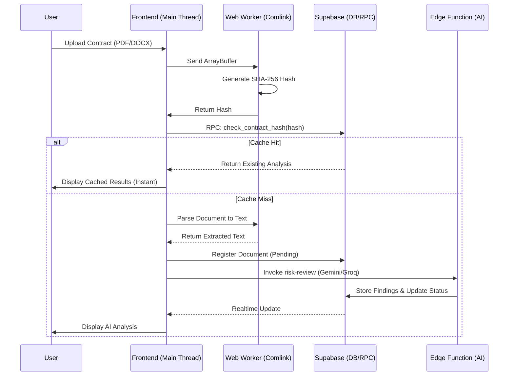
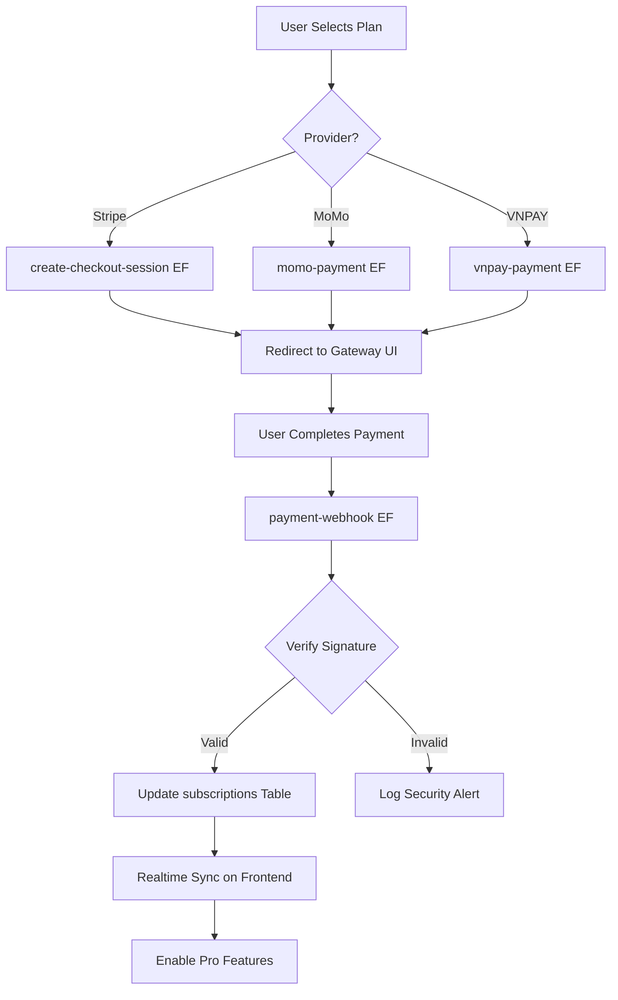

# LegalShield - AI-Powered Contract Auditor & Assistant

LegalShield is a modern Progressive Web App (PWA) designed to automate legal contract review, risk detection, and clause optimization using advanced Artificial Intelligence.

## 🚀 Key Features

- **AI Risk Analysis**: Automatically detect legal risks (Critical, Moderate, Note) in seconds using LLMs.
- **High-Performance Document Processing**: Offloads heavy PDF/DOCX parsing to Web Workers (via Comlink) to maintain a smooth 60fps UI.
- **Token-Saving Deduplication**: Hash-based content identification prevents redundant AI analysis, significantly reducing API costs.
- **Offline-First Persistence**: Leverages IndexedDB (idb-keyval) and Zustand to cache analysis results locally for offline access.
- **Hybrid Search Architecture**: Combines Full-Text Search (FTS) and Vector Search (pgvector) for lightning-fast retrieval of legal precedents and similar clauses.
- **Multi-Channel Payments**: Integrated Stripe, MoMo, and VNPAY for seamless subscription upgrades.

## 🧜 Core Workflows

### 1. Contract Analysis Pipeline
This workflow highlights our "Zero UI Lag" strategy using Web Workers and "Token-Saving" deduplication.



### 2. Payment & Subscription Flow
Unified handling for international (Stripe) and local (MoMo, VNPAY) gateways.



## 🛠 Tech Stack

- **Frontend**: React 19, Vite, Tailwind CSS, Zustand, Lucide Icons.
- **Backend/Infrastructure**: Supabase (PostgreSQL + pgvector).
- **AI Engine**: Edge Functions (Gemini & Groq), Semantic Cache with RLS.
- **Automation**: Makefile, PWA, Web Workers.

## 📋 Prerequisites

- **Node.js**: v18+
- **Supabase CLI**: For database & Edge Function management.
- **Docker**: (Required) for local Edge Function testing and development.

## ⚙️ Setup & Installation

### 1. Clone the repository and install dependencies

```bash
git clone <your-repo-url>
cd LegalEdge

# Install frontend dependencies
cd legalshield-web
npm install
```

### 2. Configure Environment Variables

Create a `.env` file in the `legalshield-web/` directory:
```env
VITE_SUPABASE_URL=your_supabase_url
VITE_SUPABASE_ANON_KEY=your_supabase_anon_key
```

Configure Secrets for Supabase Edge Functions in `supabase/.env`:
```env
GEMINI_API_KEYS=key1,key2
STRIPE_SECRET_KEY=...
MOMO_SECRET_KEY=...
VNPAY_TMN_CODE=...
```

### 3. Initialize Database & Functions

To deploy to a live Supabase project:
```bash
# Link to your Supabase project
npx supabase link --project-ref <your-project-id>

# Deploy all database migrations and edge functions
make deploy-supabase
```

### 4. Run the Application

```bash
cd legalshield-web
npm run dev
```

## 📂 Project Structure

- `/legalshield-web`: React frontend source code.
  - `/src/workers`: Performance-critical file parsing (Web Workers).
  - `/src/store`: Global state management (Zustand).
  - `/src/lib`: Document parsing logic & Supabase client.
- `/supabase`: Backend configuration.
  - `/migrations`: Optimized SQL scripts (Vector search, Cache, Materialized Views).
  - `/functions`: AI processing and Payment gateway Edge Functions.
- `Makefile`: Automation commands for streamlined deployment.
