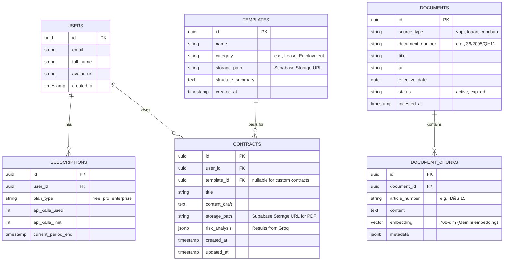

# Data Model: Legal Doc AI

This document outlines the database schema for the Legal Doc AI feature, hosted on Supabase (PostgreSQL + pgvector).

## ER Diagram


## Vector Search configuration
`DOCUMENT_CHUNKS.embedding` will be indexed using **HNSW** for fast approximate nearest neighbor (ANN) similarity search:
```sql
CREATE INDEX ON document_chunks USING hnsw (embedding vector_cosine_ops);
```
